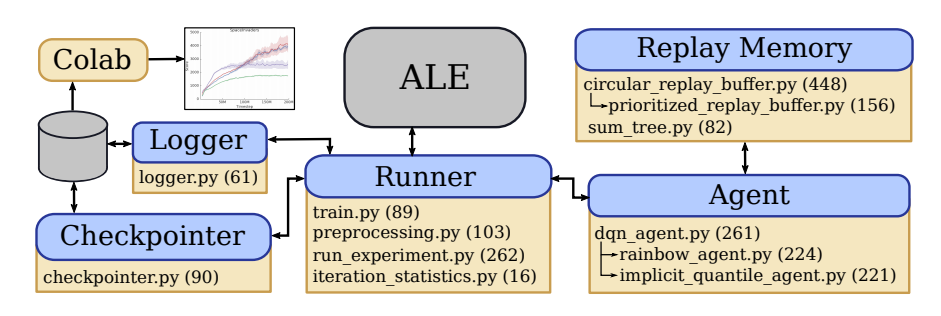

# Dopamine: A Research Framework for Deep Reinforcement Learning
## Key point:
- Type of research objectives:
  - **Architecture research**: network topology, component interactions (e.g. reply memory in DQN), A2C/A3C (fixed-length segment with rolling trajectories), ACER, Reactor, IMPALA
  - **Algorithmic research**: improve underlying algorithms (e.g. double DQN), Retrace(\lambda), distributional RL. 
  - **Comprehensive studies**: combine existing research results to benchmark under different conditions. 
  
- Software objectives for algorithmic research:
  - Simplicity: fast to implement radically different ideas is important. 
  - Require many iterations from initial design
  - Significant amount of code will be disgarded, so being easy and fast is essential. 
  - Computational efficiency is not so important: the goal is to demonstrate the feasibility of a new idea. 
  

