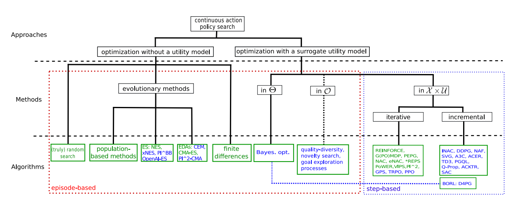
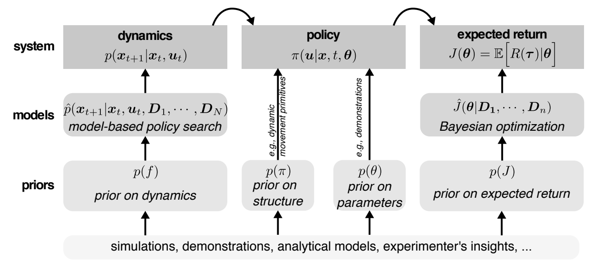

- Sample efficiency
  - Prior knownledge: policy parameters (e.g. demonstrations), policy structure (e.g. dynamic movement primitives)
  - Extract more information from observations:  learning a model
  - Sample reuse: experience 

- Policy search without utility models: sample policy parameters and move towards direction for higher utility
  - Random search: randomly searches parameters until good enough
  - Inefficient
    - No assumption on objective function
    - Without estimating any gradients
  - Population-based optimization: maintain a population and sample individuals based on previously elite set. 
  - Evolution strategies (ES): specific population-based optimization
    - Compute optimum guess from samples in previous generation
    - Samples in new generation are obtained by adding Gaussian noise to current optimum guess. 
    - Estimation of Distribution Algorithms (EDAs): specific ES by maintaining a covariance matrix e.g. CEM, CMA-ES

- Model-based policy search: learning a transition dynamics model over the observed trajectories
  - Deterministic model: suffer from model bias e.g. neural networks
  - Probabilistic model: distribution of all plausible models e.g. Gaussian processes, Bayesian neural networks
  - Bayesian optimization (BO): actively choose next observation by using acquisition functions e.g. UCB, PI, EI

- Uncertainty-driven explorations
- Meta-learning on selective, generic priors

- Reproducibility: many degree of freedoms can affect performance
  - Network architecture: number of layers, hidden size, activation functions
  - Reward scaling: scaled by a scalor, reward clipping, normalization of returns 
  - Number of random seeds
  - Wide range of environments to benchmark, not just well-performing ones
  - Report average returns by evaluating target policy over multiple episodes. 
  
- Environments for continuous control
  - Basic: CartPole Swing Up, Mountain Car, Acrobot Swing Up
  - Locomotion: Swimmer, Hopper, Walker, Half-Cheetah, Humanoid
  - Limited sensor: only positional information, exclude velocities. Agent has to learn to infer it.
  - Noisy observation: Gaussian noise to observations
  - System identification: physical model are varied across different episodes. The agents must learn to generalize across different models. 
  - Hierarchical: Locomotion + Feed collection, locomotion + maze
  
- Batched algorithms: at each iteration, collect N trajectories, each for T time steps. 
  - REINFORCE: estimate the gradient of expected return by using likelihood ratio trick. 
    - Succeed to solve locomotion tasks, but suffer from local optima
    - Even with small leraning rate, gradient steps can still result in large changes in policy
  - TRPO: controls policy update by placing constraint on KL divergence between new and old policies. 
    - Constrain the change in policy results in more stable learning
  - CEM/CMA-ES: maintain a Gaussian distribution over policy parameters based on the evaluations of samples.
    - CEM works well and sometimes outperforms CMA-ES
- Online algorithm: continuously improve policy during interactions with environment
  - DDPG: gradient descent to policy with mini-batches sampled from reply pool. 
    - Converge faster on certain tasks
    - Less stable than batch algorithms

## References:
- Policy Search in Continuous Action Domains: an Overview
- A survey on policy search algorithms for learning robot controllers in a handful of trials
- Deep Reinforcement Learning that Matters
- Benchmarking deep reinforcement learning for continuous control
